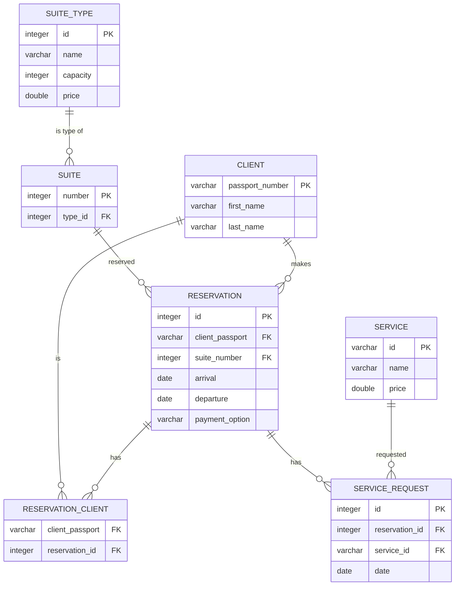

# Task

The task is to create a database for a hotel. The database should contain information about the hotel's rooms, clients,
reservations, services and payments.

# ERD Diagram

Diagram of the database schema. It is also available in the [docs/erd.jpg](docs/erd.jpg) file.

